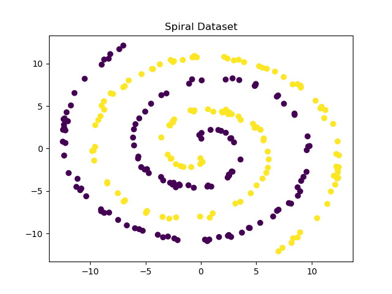

# Datasets for Binary Classification model category on Ready Tensor

This repo contains files related to the datasets used in model benchmarking for the **Binary Classification** category. There are a total of 15 benchmarking datasets used in this category. Additionally, there is a 16th dataset for smoke testing of models. The following is the list of datasets:

| Dataset                                           | Industry                       | Observations | Features | Has Categorical Features? | Has Missing Values? |
| ------------------------------------------------- | ------------------------------ | :----------: | :------: | :-----------------------: | :-----------------: |
| Breast Cancer - Wisconsin                         | Biosciences / Healthcare       |     569      |    32    |            no             |         no          |
| Concentric Spheres Dataset                        | None (synthetic)               |    3,000     |    9     |            no             |         yes         |
| Credit Approval                                   | Financial services             |     690      |    15    |            yes            |         yes         |
| Electrical Grid Stability Simulated Data Data Set | Energy                         |    10,000    |    13    |            no             |         no          |
| Employee Attrition dataset from PyCaret           | Miscellaneous / Human Resource |    14,999    |    9     |            yes            |         no          |
| Exclusive-Or dataset                              | None (synthetic)               |    6,000     |    5     |            no             |         no          |
| Image Segmentation                                | Computer Vision                |    2,310     |    20    |            no             |         no          |
| In-vehicle coupon recommendation                  | E-commerce                     |    12,684    |    25    |            yes            |         yes         |
| Mushroom Data Set                                 | Biosciences                    |    8,124     |    22    |            yes            |         yes         |
| NBA binary classification dataset from Pycaret    | Sports                         |    1,294     |    21    |            no             |         no          |
| Online Shoppers Purchasing Intention              | E-commerce                     |    12,330    |    17    |            yes            |         no          |
| Smoke Test BC                                     | None (synthetic)               |     200      |    2     |            yes            |         yes         |
| Spambase Data Set                                 | Technology / Internet Services |    4,601     |    57    |            no             |         no          |
| Spiral Dataset                                    | None (synthetic)               |     250      |    2     |            no             |         no          |
| Telco customer churn                              | Telecom                        |    7,043     |    20    |            no             |         yes         |
| Titanic Passenger Survival dataset                | Tourism / Transportation       |    1,309     |    10    |            yes            |         yes         |

More information about each dataset is provided in the sections below.

---

## Repository Structure

The `datasets` folder contains the main data files and the schema files for all the benchmark datasets under Binary Classification category.

- The `raw` folder contains the original data files from the source (see attributions below). The Jupyter notebook file within each dataset folder is used to convert the raw data file for each dataset into the full processed dataset in `raw` folder into the processed form in `processed` folder.
- `processed` folder contains the processed files. These files are used in algorithm evaluations.

  - The CSV file with suffix "\_train.csv" is used for training
  - "\_test.csv" is used for testing (without the targets)
  - "\_test_key.csv" contains the ids and targets for the test data. This test key file is used to generate scores by comparing with predictions.
  - The JSON file with suffix "\_schema.json" is the schema file for the corresponding dataset.
  - The json file with the suffix "\_inference_requeest_sample.json" contains a sample JSON object with the data to make an inference request to the /infer endpoint.
  - The CSV file with the dataset name, and no other suffix, is the full data (made of both train and test sets).

- The folder `config` contains two csv files - one called `binary_classification_datasets_metadata.csv` which contains the dataset level attribute information. The second csv called `binary_classification_datasets_fields.csv` contains information regarding all the fields in each of the datasets.
- `generate_schemas.py`: contains the code to generate the schema files for each dataset.
- `create_train_test_key_files.py`: contains the code to generate the train, test, and test-key files for each dataset.
- `generate_inference_data.py`: contains the code to generate the inference request sample data for each dataset.
- `run_all.py`: This is used to run the above three scripts in sequence.

---

The following is the list of datasets along with a brief description for each and its attribution:

---

## Breast Cancer - Wisconsin

#### Alias (in scorecards): cancer

#### Domain / Industry: Biosciences

#### Description

Dataset for breast tumor diagnosis. Predict diagnosis: B = benign, M = malignant. Features are computed from a digitized image of a fine needle aspirate (FNA) of a breast mass. They describe characteristics of the cell nuclei present in the image.

#### Dataset characteristics

- Number of samples = 569
- Number of input features = 32
- Has categorical features = No
- Has missing values = No

#### Attribution

Creators: <br/>
Dr. William H. Wolberg, General
W. Nick Street, Computer Sciences
Olvi L. Mangasarian, Computer
Donor: Nick Street

Dataset can be found here:<br/>
https://archive.ics.uci.edu/ml/datasets/Breast+Cancer+Wisconsin+(Diagnostic)
UCI Machine Learning Repository [http://archive.ics.uci.edu/ml]. Irvine, CA: University of California, School of Information and Computer Science.

---

## Concentric spheres

#### Alias (in scorecards): concentric_spheres

#### Domain / Industry: None (synthetic data) 

#### Description

A synthetic dataset consisting of two concentric spheres, meant to mimic a binary classification problem in a 3-dimensional space. The spheres are represented by two sets of data points, one set for each class, with each set forming a sphere of different radius in a 3D space.

Two sets of points are generated on the surfaces of two spheres with different radii. Each point on a sphere's surface is computed using randomly generated azimuthal angles and z-coordinates, which are then converted to x, y, and z coordinates using spherical to Cartesian coordinate transformation. A small Gaussian noise is added to these coordinates to simulate real-world measurement errors. These `x`, `y`, and `z` coordinates are the main three features in the dataset.

Next, dummy features are added to the dataset. These features are randomly generated and are not related to the target class, simulating irrelevant or noise features often present in real-world datasets.

Then, correlated features are added. These are derived from the original `x`, `y`, and `z` coordinates, being a linear combination of the original feature and some added noise. This mimics scenarios where features are not entirely independent of each other.

Finally, a portion of the values in the dataset is replaced with null values to simulate missing data, which is a common challenge in real-world datasets.

The final dataset includes the x, y, z coordinates, the target class, an id for each data point, three dummy features, and three correlated features with a small percentage of missing values for each of the features.

See plot of generated data:

<div style="text-align:center;">
  
</div>

#### Dataset characteristics

- Number of samples = 3,000
- Number of input features = 9
- Has categorical features = No
- Has missing values = Yes

#### Attribution

Synthetically generated data.

---

## Credit Card

#### Alias (in scorecards): credit_card

#### Domain / Industry: Financial services

#### Description

This file concerns credit card applications. All attribute names and values have been changed to meaningless symbols to protect confidentiality of the data.
In the original dataset, the target classes were marked as “+” and “-”. These have been replaced by “positive” and “negative”.

#### Dataset characteristics

- Number of samples = 690
- Number of input features = 15
- Has categorical features = Yes
- Has missing values = Yes

#### Attribution

Submitted by: quinlan@cs.su.oz.au

Usage: <br/>
See Quinlan:

- "Simplifying decision trees", Int J Man-Machine Studies 27, Dec 1987, pp. 221-234.
- "C4.5: Programs for Machine Learning", Morgan Kaufmann, Oct 1992

Dataset can be found here: <br/>
https://archive.ics.uci.edu/dataset/27/credit+approval <br/>
UCI Machine Learning Repository [http://archive.ics.uci.edu/ml]. Irvine, CA: University of California, School of Information and Computer Science.

---

## In-vehicle coupon recommendation

#### Alias (in scorecards): coupon_recommendations

#### Domain / Industry: E-commerce

#### Description

This data studies whether a person will accept the coupon recommended to them in different driving scenarios.

#### Dataset characteristics

- Number of samples = 12,684
- Number of input features = 25
- Has categorical features = Yes
- Has missing values = Yes

#### Attribution

Source: <br/>
Wang, Tong, Cynthia Rudin, Finale Doshi-Velez, Yimin Liu, Erica Klampfl, and Perry MacNeille. 'A bayesian framework for learning rule sets for interpretable classification.' The Journal of Machine Learning Research 18, no. 1 (2017): 2357-2393.

Dataset can be found here: <br/>
https://archive.ics.uci.edu/ml/datasets/in-vehicle+coupon+recommendation

UCI Machine Learning Repository [http://archive.ics.uci.edu/ml]. Irvine, CA: University of California, School of Information and Computer Science.

---

## Electrical Grid

#### Alias (in scorecards): electrical_grid

#### Domain / Industry: Energy

#### Description

This dataset stems from the local stability analysis of the 4-node star system (electricity producer is in the center) implementing Decentral Smart Grid Control concept.
The analysis is performed for different sets of input values using the methodology similar to that described in:
Schäfer, Benjamin, et al. 'Taming instabilities in power grid networks by decentralized control.' The European Physical Journal Special Topics 225.3 (2016): 569-582.

#### Dataset characteristics

- Number of samples = 10,000
- Number of input features = 13
- Has categorical features = No
- Has missing values = No

#### Attribution

Creator and donor: Vadim Arzamasov (vadim.arzamasov '@' kit.edu ), <br/>
Department of computer science, <br/>
Karlsruhe Institute of Technology; <br/>
Karlsruhe, 76131; Germany

Dataset can be found here: <br/>
https://archive.ics.uci.edu/ml/datasets/Electrical+Grid+Stability+Simulated+Data+ <br/>
UCI Machine Learning Repository [http://archive.ics.uci.edu/ml]. Irvine, CA: University of California, School of Information and Computer Science.

---

## Employee Attrition

#### Alias (in scorecards): employee_attrition

#### Domain / Industry: Unknown

#### Description

This dataset is available through PyCaret. The task is to predict whether an employee underwent attrition using predictor features such as satisfaction_level, salary category, department, average monthly hours, promotion in last 5 years, etc.
Original source and detailed dataset description are unknown.

#### Dataset characteristics

- Number of samples = 14,999
- Numberof input features = 9
- Has categorical features = Yes
- Has missing values = No

#### Attribution

Original source of data is unknown. <br/>
Dataset can be loaded through PyCaret as follows:

```
from pycaret.datasets import get_data
employee_data = get_data(“employee”)
```

---

## Image Segmentation

#### Alias (in scorecards): image_segmentation

#### Domain / Industry: Unknown

#### Description

Image data described by high-level numeric-valued attributes. The task is to predict the class of the image. Binarized version of the original data set. Original dataset contained 7 classes. The multi-class target feature is converted to a two-class nominal target feature by re-labeling the majority class as positive ('P') and all others as negative ('N'). Originally converted by Quan Sun.

#### Dataset characteristics

- Number of samples = 2,310
- Number of input features = 19
- Has categorical features = No
- Has missing values = No

#### Attribution

Original source: Unknown <br/>
Dataset can be found here: <br/>
https://www.openml.org/d/958

---

## Mushroom

#### Alias (in scorecards): mushroom

#### Domain / Industry: Biosciences

#### Description

Mushrooms described in terms of physical characteristics; classification task: poisonous or edible.

#### Dataset characteristics

- Number of samples = 8,124
- Number of input features = 22
- Has categorical features = Yes
- Has missing values = Yes

#### Attribution

Source: <br/>
Mushroom records drawn from The Audubon Society Field Guide to North American Mushrooms (1981). G. H. Lincoff (Pres.), New York: Alfred A. Knopf <br/>
Donor: Jeff Schlimmer (Jeffrey.Schlimmer '@' a.gp.cs.cmu.edu)

Dataset can be found here: <br/>
UCI Machine Learning Repository: Mushroom Data Set - https://archive.ics.uci.edu/ml/datasets/mushroom <br/>
UCI Machine Learning Repository [http://archive.ics.uci.edu/ml]. Irvine, CA: University of California, School of Information and Computer Science. <br/>

---

## NBA

#### Alias (in scorecards): nba

#### Domain / Industry: Sports

#### Description

Dataset description unavailable.

#### Dataset characteristics

- Number of samples = 1,294
- Number of input features = 21
- Has categorical features = No
- Has missing values = No

#### Attribution

Original source of data is unknown. <br/>
Dataset can be loaded through PyCaret as follows:

```
from pycaret.datasets import get_data
nba_data = get_data(“nba”)
```

---

## Online Shoppers Purchasing Intention

#### Alias (in scorecards): online_shopping

#### Domain / Industry: E-commerce

#### Description

Dataset for real-time prediction of online shoppers purchasing intention

#### Dataset characteristics

- Number of samples = 12,330
- Number of input features = 17
- Has categorical features = yes
- Has missing values = No

#### Attribution

Source: <br/>

1. C. Okan Sakar <br/>
   Department of Computer Engineering <br/>
   Faculty of Engineering and Natural Sciences, Bahcesehir University, <br/>
   34349 Besiktas, Istanbul, Turkey

2. Yomi Kastro <br/>
   Inveon Information Technologies Consultancy and Trade <br/>
   34335 Istanbul, Turkey

Data used in this paper: <br/>
Sakar, C.O., Polat, S.O., Katircioglu, M. et al. Real-time prediction of online shoppers’ purchasing intention using multilayer perceptron and LSTM recurrent neural networks. Neural Comput & Applic 31, 6893–6908 (2019). https://doi.org/10.1007/s00521-018-3523-0

Dataset can be found here: <br/>
https://archive.ics.uci.edu/ml/datasets/Online+Shoppers+Purchasing+Intention+Dataset#

---

## Smoke Test - BC Dataset

#### Alias (in scorecards): smoke_test_bc

#### Domain / Industry: None (synthetic data)

#### Description

This is a synthetically generated dataset that is used for smoke testing the binary classification algorithms. The dataset presents a classification problem based on two types of features and a binary target. Each sample in the dataset has a unique identifier, a set of two features (color, number), and a target class label.

The first feature 'color' is a categorical feature, with three possible values: Red, Green, and Blue. These values are evenly and randomly distributed across the dataset.

The second feature 'number' is a continuous feature, with values drawn from a uniform distribution between 1 and 100 inclusive. Each feature value is independent of the others.

The class label for each sample is determined by the combination of both the categorical and numerical features. If the color is 'Red' and the number is greater than 50, the sample is labeled as Class 1, otherwise, it is labeled as Class 0. This forms a classification problem, where the task is to classify samples based on the combination of their color and number features.

The identifiers for the samples are randomly generated alphanumeric strings. They are used to uniquely identify each sample in the dataset.

Additionally, to add complexity to the dataset, approximately 10% of the data points in each feature are replaced with missing values. Furthermore, the first row always contains a missing value in either of the two features randomly, to ensure the presence of missing data even for smaller datasets.

In summary, this dataset presents a binary classification problem, where the task is to classify samples based on the combination of a categorical and numerical feature, while also dealing with missing data. The relationship between the features and target is known, however, the presence of missing values introduces complexity and makes it a challenging task for binary classification algorithms.

#### Dataset characteristics

- Number of samples = 200
- Number of input features = 2
- Has categorical features = yes
- Has missing values = yes

#### Attribution

This dataset is synthetically generated.

---

## Spambase

#### Alias (in scorecards): spambase

#### Domain / Industry: Technology / Internet Services

#### Description

This dataset contains collection of spam and non-spam emails converted to numerical features. Spam e-mails came from postmaster and individuals who had filed spam.Non-spam e-mails came from filed work and personal e-mails, and hence the word 'george' and the area code '650' are indicators of non-spam. These are useful when constructing a personalized spam filter. One would either have to blind such non-spam indicators or get a very wide collection of non-spam to generate a general purpose spam filter.

#### Dataset characteristics

- Number of samples = 4,601
- Number of input features = 57
- Has categorical features = No
- Has missing values = No

#### Attribution

Creators: <br/>
Mark Hopkins, Erik Reeber, George Forman, Jaap Suermondt <br/>
Hewlett-Packard Labs, 1501 Page Mill Rd., Palo Alto, CA 94304

Dataset can be found here: <br/>
UCI Machine Learning Repository: <br/>
https://archive.ics.uci.edu/ml/datasets/spambase <br/>
UCI Machine Learning Repository [http://archive.ics.uci.edu/ml]. Irvine, CA: University of California, School of Information and Computer Science.

---

## Spiral Dataset

#### Alias (in scorecards): spiral

#### Domain / Industry: None (synthetic data) 

#### Description

This dataset is synthetically generated. This dataset consists of two spiral patterns in a 2D space, each representing a unique class.

The dataset creation takes inspiration from polar coordinates, which is a two-dimensional coordinate system where each point on a plane is determined by a distance from a reference point (usually the origin) and an angle from a reference direction.

The spirals are created using the equation of a logarithmic spiral in polar coordinates, `r = a _ e^(b _ θ)`. In this equation, r is the distance of a point from the origin, `θ` is the angle, and `a` and `b` are real numbers which affect the size and tightness of the spiral. We're setting `a = 780` and `b = 1`, but by playing around with these numbers you can get different spiral shapes.

The function first generates a random set of n_points_each distances (radii) from the origin. It then calculates the corresponding angle for each point using the formula for a spiral. Then, these polar coordinates are converted to Cartesian coordinates (i.e., x and y coordinates) using the sin and cos functions, with some added random noise to make the data more realistic and less perfectly spiral-shaped. The function generates two spirals: one in the positive direction and one in the negative direction.

See generated data:

<div style="text-align:center;">
  
</div>

#### Dataset characteristics

- Number of samples = 250
- Number of input features = 2
- Has categorical features = No
- Has missing values = No

#### Attribution

Synthetically generated data

---

## Telco Churn

#### Alias (in scorecards): telco_churn

#### Domain / Industry: Telecom

#### Description

Dataset regarding customer churn in telecom industry. <br/>
Context "Predict behavior to retain customers. You can analyze all relevant customer data and develop focused customer retention programs." [IBM Sample Data Sets]

#### Dataset characteristics

- Number of samples = 7,043
- Numberof input features = 19
- Has categorical features = No
- Has missing values = Yes

#### Attribution

Original source: <br/>
https://community.ibm.com/community/user/businessanalytics/blogs/steven-macko/2019/07/11/telco-customer-churn-1113

Sourced from Kaggle: <br/>
https://www.kaggle.com/datasets/blastchar/telco-customer-churn

---

## Titanic

#### Alias (in scorecards): titanic

#### Domain / Industry: Travel / Miscellaneous

#### Description

Dataset regarding attributes of passengers on the Titanic. Data can be used to build a predictive model that answers the question: “what sorts of people were more likely to survive?” using passenger data (i.e. age, gender, fare, ticket class, port of embarkation, etc).

#### Dataset characteristics

- Number of samples = 1309
- Numberof input features = 7
- Has categorical features = Yes
- Has missing values = Yes

#### Attribution

Sourced from: <br/>
https://www.openml.org/search?type=data&status=active&id=40945

---

## Exclusive-Or Dataset

#### Alias (in scorecards): xor

#### Domain / Industry: None (synthetic data) 

#### Description

This synthetic dataset is based on the n-dimensional XOR problem. Each sample in the dataset has an identifier, a set of 5 features (x1, x2, ..., x5), and a target class label.

The features are continuous values drawn from a uniform distribution between 0 and 1. Each feature value is independent of the others. They are generated such that they are evenly distributed over the interval [0, 1].

The class label for each sample is determined by the number of features in that sample which have values less than 0.5. If the number of features less than 0.5 is odd, the sample is labeled as Class 1. If the number of features less than 0.5 is even, the sample is labeled as Class 0. This creates an n-dimensional XOR classification problem.

The identifiers in the `id` field for the samples are randomly generated alphanumeric strings. They are used to uniquely identify each sample in the dataset.

In summary, this dataset presents an n-dimensional XOR problem, where the task is to classify samples based on whether the number of their features less than 0.5 is odd or even. The relationship between features and target would be unknown to us. This makes it a challenging task for binary classification algorithms, especially when the number of dimensions is high.

#### Dataset characteristics

- Number of samples = 6000
- Numberof input features = 5
- Has categorical features = No
- Has missing values = Yes

#### Attribution

Synthetically generated data

---
